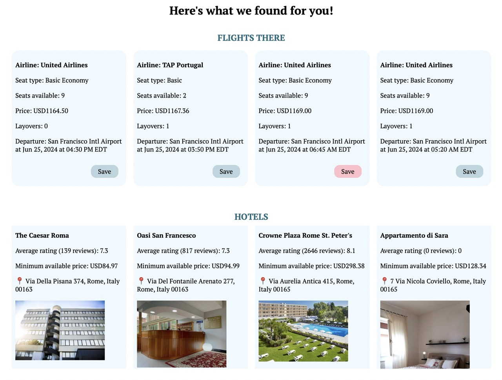
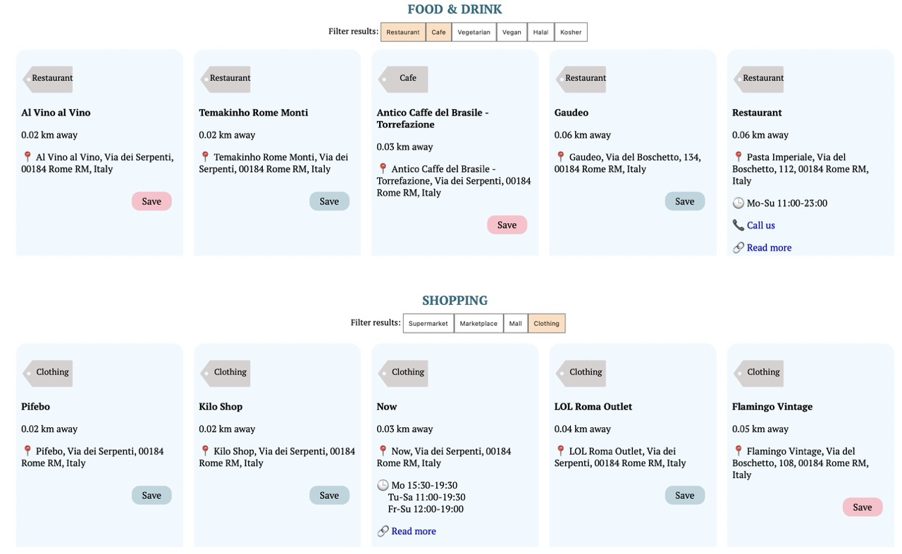
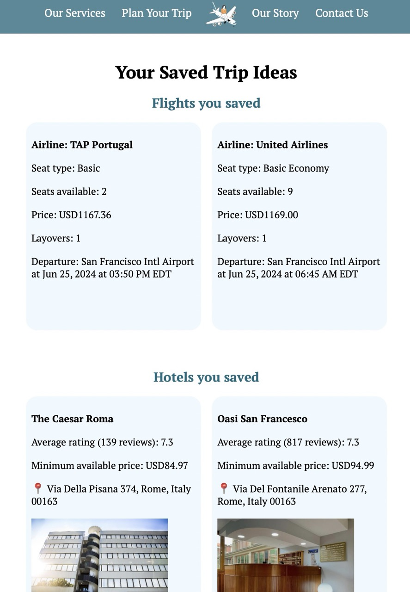
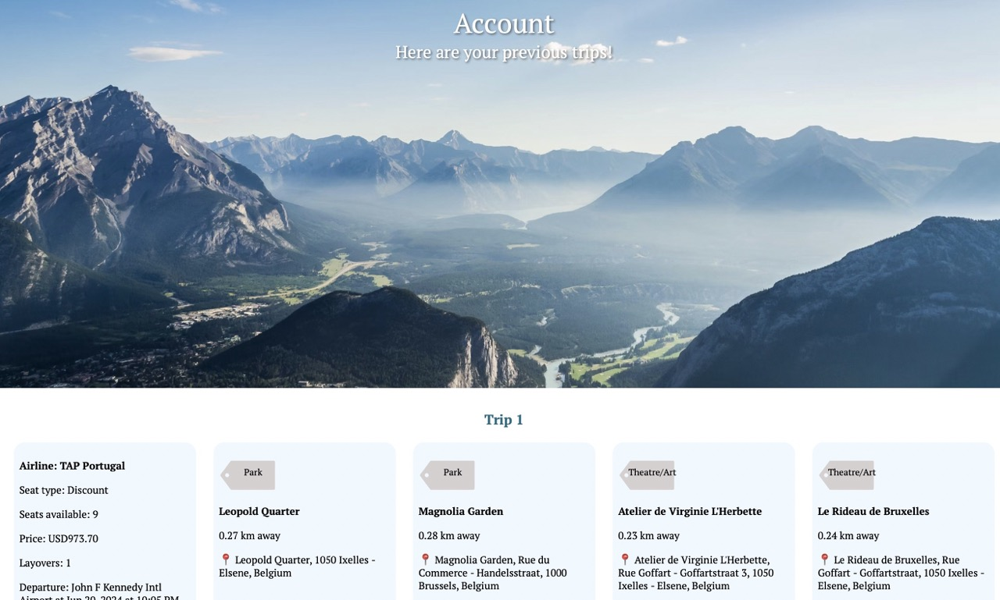

# Travel Buddy

Looking for cultural places, adventures in nature, or classic tourist sites? Curate your travel activities with TravelBuddy. 

By Joanne, Lillian, Sristi, and Shannon, for a web programming course.

Written with HTML, CSS, JavaScript, PHP, MySQL. 

--
### Bugs ⚠️

One of the free APIs (for plane tickets) we used is *sometimes* unreliable, but you can expect results from the other APIs (hotels, travel sites). There may also be a bug on the server side with user sign-in since the PHP was hastily written. I have yet to fix the code (my apologies!), but sign/log in is not necessary to play with the website's main functionality (screenshots below). 

Check out the website at https://joannef.sgedu.site/travelbuddy/.

Fill out a form about your upcoming trip...

Browse the ideas we generate and save any you like...

View your saved flights, hotels, and activities...

View all saved trips if you created an account...

