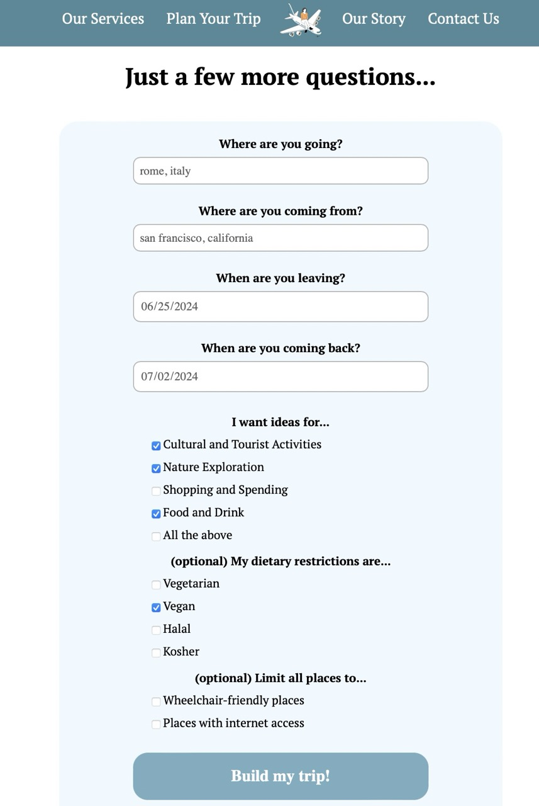

# Travel Buddy

Looking for cultural places, adventures in nature, or classic tourist sites? Curate your travel activities with TravelBuddy. 

By Joanne, Lillian, Sristi, and Shannon, for a web programming course.

Written with HTML, CSS, JavaScript, PHP, MySQL. 

--
### Demo

Check out the website at https://joannef.sgedu.site/travelbuddy/.

Fill out a form about your upcoming trip...

Browse the ideas we generate and save any you like...

View your saved flights, hotels, and activities...

Sign/log in is not necessary to play with the website's main functionality. 
If you create an account, you can view all saved trips...

